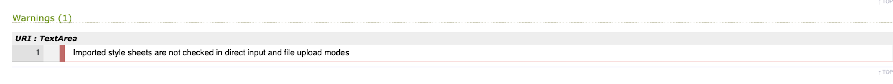

# Destination Film - Testing details

[Back to README.md file](README.md)

[Live Website](https://mosull20.github.io/destination-film-ms2/)

## Code Validation

1. HTML validated on [W3C Markup Validation Servive](https://validator.w3.org/)
    * Home Page - no errors or warnings 
    * Destinations Page - at first pass, 53 errors/warnings were shown. This turned out to be a handful of errors that were repeated through the different sections on the page, details as follows: 
    1. Too many consecutive hypens in some of my comments, I corrected this
    2. Stray end `</a>` tag - I removed this
    3. Empty headings (repeated through each section) in the `<h2 class="city-name d-inline"></h2>` and `<h3 class="city-temp d-inline"></h3>` headings. This was empty as being filled using a weather API in JavaScript. I corrected this error by putting in placeholder text describing the content to go in ie. 'City' and 'Temperature'. That eliminated this error and provided a semantic description of the content of that heading.
    4. Error re Bad value for attribute src on element img: must be non empty. This was left empty originally as being filled with content pulled from Weather API in JavaScript. I found a solution to this on [Stack Overflow](https://stackoverflow.com/questions/30658663/bad-value-for-attribute-src-on-element-img-must-be-non-empty-for-dynamically) which was simply to put a placeholder '#' in the src attribute. This worked and eliminated the error warnings. Again, I had this repeated in each of 5 sections so that error message was repeated. 
    5. Stray end tag (repeated in each section) `</img>` - I removed this as the img tag is self closing and does not need an end tag. 
    6. Error re 'span not allowed as child element of ul in this context' - I had a span tag after my li closing tag in order to put a '|' in between the li items that would not be affected by the hover.css class I had on the li elements. I corrected this error by simply removing the span tag and replacing it with li tag to encompass the '|' in it's own element without the 'hvr-skew-forward' class on it. Again, this error was repeated approx 20 times across all the different sections.
    7. Duplicate id 'icon' - this was an id I had on the div enclosing the `` for the weather icon being pulled from the weather API. I had put in this id when I was originally writing this section of code, but didn't need it as I had used the class name instead to target each section to manipulate the content using JavaScript. I simply removed all the `div id="icon"` occurances.
    + On correcting each repetition of the above 7 basic errors/warnings, the code then passed with no further errors or warnings.

    * Contact Page - 2 warnings and 1 error were shown. 
    
    + I removed the type attribute from both instances as shown above and I removed the stray script tag as above
    + After making the above amendments and running the code through the validator again, it passed with no warnings or errors. 

2. CSS validated on [Jigsaw W3C CSS Validation Service](https://jigsaw.w3.org/css-validator/validator)
    *  Passed with no errors found

    * One warning was found

    * No action required as the @import content cannot be checked

3. JavaScript validated on [JSHint](https://jshint.com/)

    * All js files run through JSHint, on first run I got many errors to do with es6, on searching Code Institute Slack community, I found adding the following lines `/* jshint esversion: 6 */
/* globals $:false */` corrected many of these warnings. 

    * Weather.js file: most errors related to the recommendation of using dot notation in places, and missing or unnecessary semi-colons. All these I was able to correct. Another warning related to "one unused variable $". This refers to the second line above (`/* globals $:false */`). I removed this as it was not required in this file. No warnings remain.
    

    * Maps.js - The second file with multiple errors was my maps.js file. The warnings were due to the fact that I was reusing variables that were already defined. I have detailed this below in bugs and fixes. 
    
    After taking the actions detailed below and running the code through again, 2 warnings remain - one to do with 'google' being an undefined variable. As this is from google maps api code, I did not want to change any code but I found a solution on [Ember.js](https://discuss.emberjs.com/t/google-is-not-defined-jshint-error/5762) which was to add `/* global google */` at the top of the file. It also shows initMap as an unused variable. My initMap() function defined here is called in destinations.html as per google api code, so jshint does not see this. 

    * Destinations.js file passes with no errors or warnings

    * SendEmail.js - logs one undefined variable (emailjs) and one unused variable (sendMail). This code is from the emailJS API and is called in my contact.html file. 

    * Script.js - 

    
## Manual Testing
### Lighthouse Testing
### Functionality Testing
### User Stories Testing
### Bugs & Fixes

* After including Google Maps API as per the documentation, I kept getting an error in the console to say that `'initMap' is not a function`. On searching the internet, I found the solution [here - at elharony.com](https://www.elharony.com/initmap-is-not-a-function/). The solution that worked for me was to switch the order so that my maps.js file loads ahead of the google maps script. Otherwise, the function is called when the computer has not yet loaded the file containing the function itself. 

* I was getting an error message in the console of `Uncaught TypeError: Cannot set property 'innerHTML' of null at script.js` when on the home page. After going through what scripts I had linked on the index.html page and what I had in the script.js file which utilized the innerHTML property, I discovered I had included the script.js file on the index.html page where it was not required and the element with the id of 'quotes-box' that I was targeting with innerHTML did not exist on that page, hence the error message. Once I removed the link to script.js on index.html, the issue was resolved. 

* Issue with height on the contact page. When setting height to 100vh as desired for the background image to always cover the browser window, content in the form div would spill out over the footer if browser window height made small. But if I set the height in pixels, the content would leave a gap at the foot of the window if made too large. Tried many different fixes with adjusting height of the parent and child divs, positioning of parent and child divs etc. After much searching, I found a solution on Stack Overflow [here](https://stackoverflow.com/questions/52394425/100vh-cuts-off-content-when-window-height-is-small) which recommended a very simple fix - set height to `min-height: 100vh` instead of `height:100vh`.

* Issue with fixing the maps.js map function so as to correct my orginial mistake of repeating variables that were already defined - This took me a while to fix as when I tried to give the variables a different name, the markers stopped being visible on the maps. I tried a number of fixes, asked for tutor assistance but in the end I wrapped each map in a separate function to be called when the arrow would be clicked by the user. I feel while this solution worked for me, I'm aware it may not be the best, most efficient way but I do need to do further study on that outside the time constraints of this project. It is my intention to come back to this project in the future and refactor much of my JS code once I have gained some further experience and have more time to practice JavaScript outside the course time frame. 